# Formal Model & Verification Semantics

*Part of the ProofGate ZP-11 documentation set*

## Abstract

This document gives a precise, implementation-independent account of what ProofGate ZP-11 (`zp11/v1`) *means*. It fixes the mathematical objects the standard manipulates — changes, zones, verdicts, receipts, digests, signatures, packs, and seals — states the verification algorithm as a total decision function, and argues that the function is **sound** (it never permits a merge for a pack that was not produced by an honest, complete gate run bound to the trusted key) and **fail-closed** (every ambiguity resolves to refusal). The treatment follows the normative text of `SPEC.md` and the reference library in `zp11/` exactly, and is intended to be checkable against both. ZP-11 was invented and authored by Naquib Hatami and is published as an open standard under the MIT License (iQs Group Inc. / SADI AI Inc.; repository `github.com/iQs-Group/ZP-11`, homepage `zp11.org`).

---

## 1. Notation and scope

We model one gate evaluation over one proposed change to a protected branch. The standard's defining property is an **asymmetry**: a change advances only on affirmative, reproducible evidence, and anything else — a crash, a timeout, a missing file, an unparseable result, silence — resolves to `FAIL`. The whole formal development exists to make that asymmetry a theorem rather than a hope.

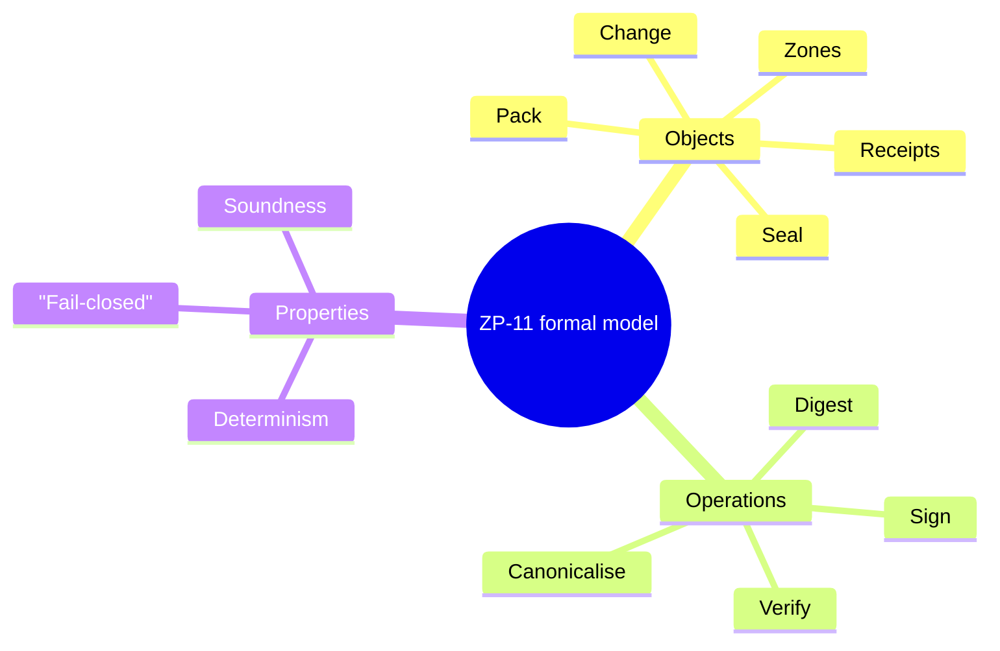
```mermaid
mindmap
  root(("ZP-11 formal model"))
    Objects
      Change
      Zones
      Receipts
      Pack
      Seal
    Operations
      Canonicalise
      Digest
      Sign
      Verify
    Properties
      Soundness
      "Fail-closed"
      Determinism
```

Symbols used throughout:

| Symbol | Meaning |
|--------|---------|
| `Σ` | the set of octet strings (bytes) |
| `J` | the set of JSON-compatible values admitting a canonical form |
| `c` | the canonicalisation function `J → Σ` (RFC 8785 subset) |
| `H` | SHA-256, `Σ → Σ₃₂` |
| `(sk, pk)` | an Ed25519 key pair (RFC 8032) |
| `S_sk`, `V_pk` | Ed25519 sign / verify |
| `V = {PASS, FAIL}` | the verdict set |
| `P` | a Proof-Pack |
| `K` | the public key supplied to a verifier |

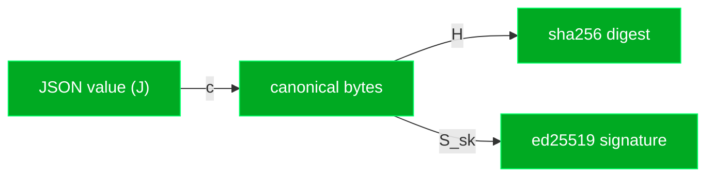
```mermaid
flowchart LR
    J["JSON value (J)"] -->|"c"| B["canonical bytes"]
    B -->|"H"| D["sha256 digest"]
    B -->|"S_sk"| G["ed25519 signature"]
    classDef n fill:#0a2,stroke:#0f6,color:#fff;
    class J,B,D,G n;
```

The model is deliberately small: four cryptographic primitives, one verdict algebra, and one decision function. Everything a verifier needs travels inside the pack plus `K`.

---

## 2. The change and the gate run

A **change** is a record `change = {id?, source_commit?, builder?}`. The gate evaluates a fixed, ordered family of eleven **zones** against a working root and that change.

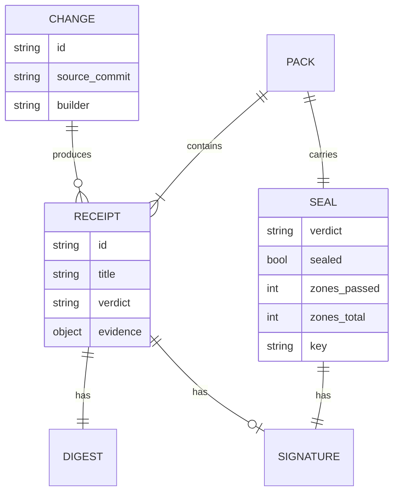
```mermaid
erDiagram
    CHANGE ||--o{ RECEIPT : "produces"
    PACK ||--|{ RECEIPT : "contains"
    PACK ||--|| SEAL : "carries"
    RECEIPT ||--|| DIGEST : "has"
    RECEIPT ||--o| SIGNATURE : "has"
    SEAL ||--|| SIGNATURE : "has"
    CHANGE {
        string id
        string source_commit
        string builder
    }
    RECEIPT {
        string id
        string title
        string verdict
        object evidence
    }
    SEAL {
        string verdict
        bool sealed
        int zones_passed
        int zones_total
        string key
    }
```

The eleven zones are fixed by name and order:

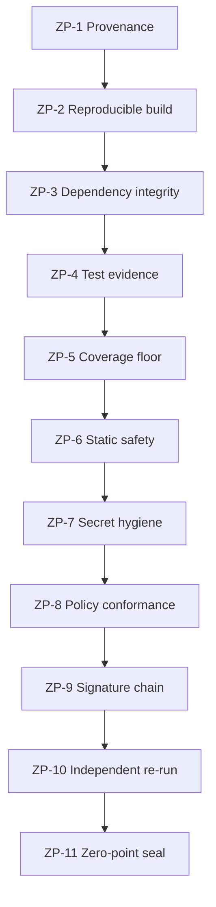
```mermaid
flowchart TB
    Z1["ZP-1 Provenance"] --> Z2["ZP-2 Reproducible build"]
    Z2 --> Z3["ZP-3 Dependency integrity"]
    Z3 --> Z4["ZP-4 Test evidence"]
    Z4 --> Z5["ZP-5 Coverage floor"]
    Z5 --> Z6["ZP-6 Static safety"]
    Z6 --> Z7["ZP-7 Secret hygiene"]
    Z7 --> Z8["ZP-8 Policy conformance"]
    Z8 --> Z9["ZP-9 Signature chain"]
    Z9 --> Z10["ZP-10 Independent re-run"]
    Z10 --> Z11["ZP-11 Zero-point seal"]
```

Each zone is a pure function of its declared input to a `ZoneResult = (verdict, evidence)`. The gate composes them left to right, derives ZP-11 from whether all prior zones passed, and seals.

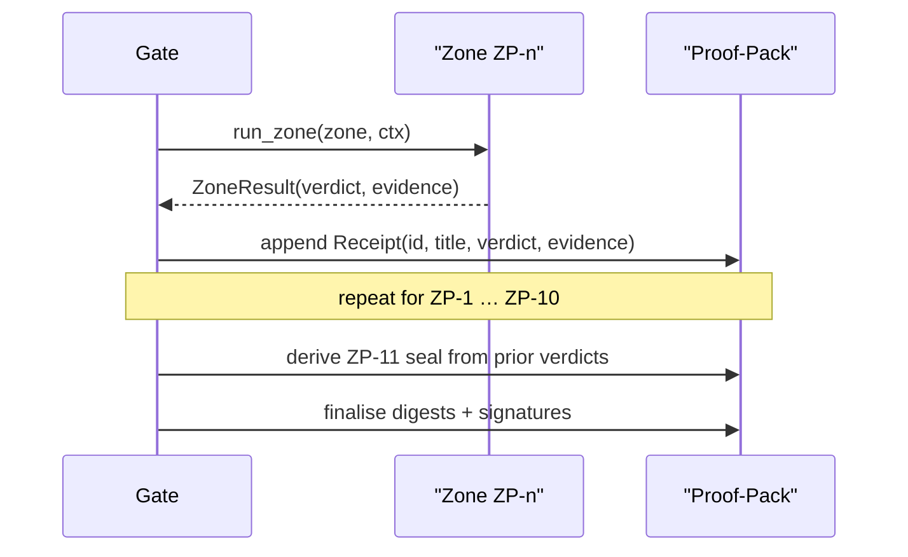
```mermaid
sequenceDiagram
    participant G as Gate
    participant Z as "Zone ZP-n"
    participant P as "Proof-Pack"
    G->>Z: run_zone(zone, ctx)
    Z-->>G: ZoneResult(verdict, evidence)
    G->>P: append Receipt(id, title, verdict, evidence)
    Note over G,P: repeat for ZP-1 … ZP-10
    G->>P: derive ZP-11 seal from prior verdicts
    G->>P: finalise digests + signatures
```

---

## 3. Verdict algebra

The verdict set is the two-element lattice `FAIL ⊑ PASS` under the ordering where `FAIL` is bottom. The reference encodes this directly: `Verdict` is a string enum whose `PASS` is truthy and `FAIL` is falsy.

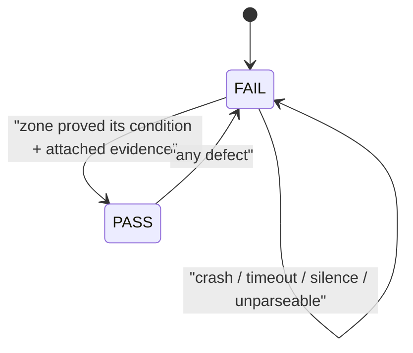
```mermaid
stateDiagram-v2
    [*] --> FAIL
    FAIL --> PASS: "zone proved its condition + attached evidence"
    PASS --> FAIL: "any defect"
    FAIL --> FAIL: "crash / timeout / silence / unparseable"
```

**Definition 3.1 (coercion).** A total map `coerce : Anything → V` sends the literal `PASS`, the string `"PASS"` (trimmed, upcased), and boolean `True` to `PASS`; *everything else* — including exceptions caught upstream — to `FAIL`.

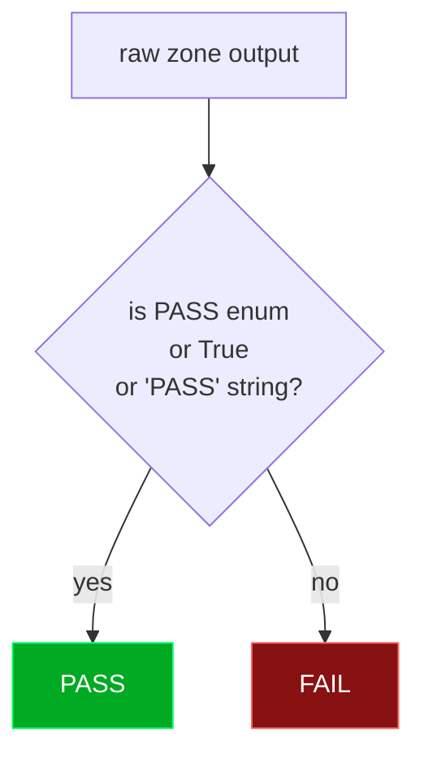
```mermaid
flowchart TD
    X["raw zone output"] --> Q1{"is PASS enum<br/>or True<br/>or 'PASS' string?"}
    Q1 -->|yes| PA["PASS"]
    Q1 -->|no| FA["FAIL"]
    classDef ok fill:#0a2,stroke:#0f6,color:#fff;
    classDef no fill:#811,stroke:#f66,color:#fff;
    class PA ok; class FA no;
```

The pack verdict is the **meet** (logical AND) over all receipt verdicts, with the empty conjunction defined as `FAIL` (not the usual vacuous `true`), so a pack with no receipts cannot pass.

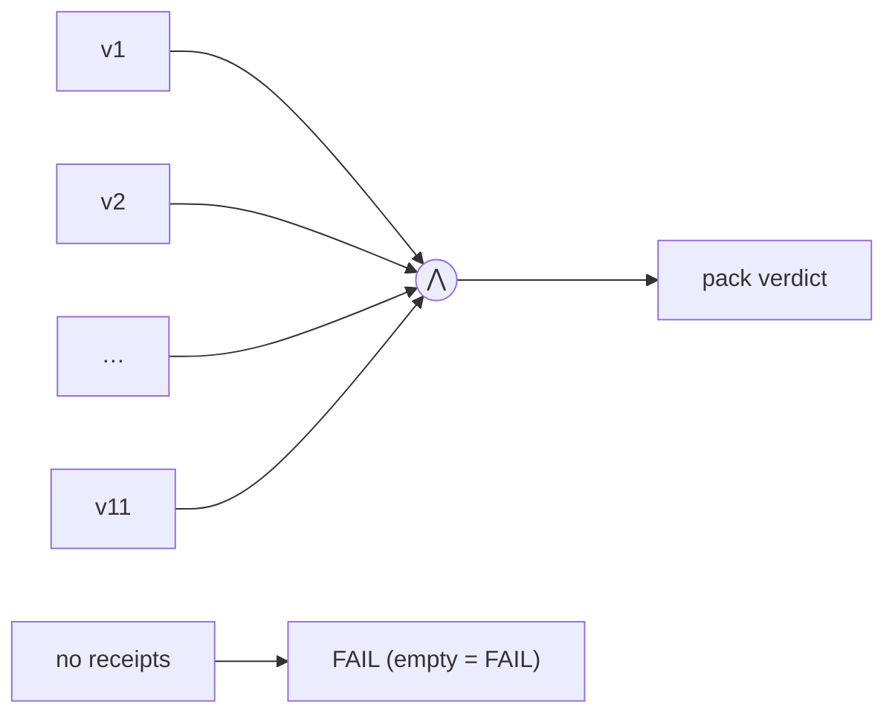
```mermaid
flowchart LR
    R1["v1"] --> AND(("⋀"))
    R2["v2"] --> AND
    R3["…"] --> AND
    R11["v11"] --> AND
    AND --> PV["pack verdict"]
    E["no receipts"] --> F["FAIL (empty = FAIL)"]
```

**Lemma 3.2.** The map `verdict(P) = ⋀ᵢ vᵢ` is monotone: weakening any single zone to `FAIL` can only weaken the pack verdict. This is what makes each zone an independent veto.

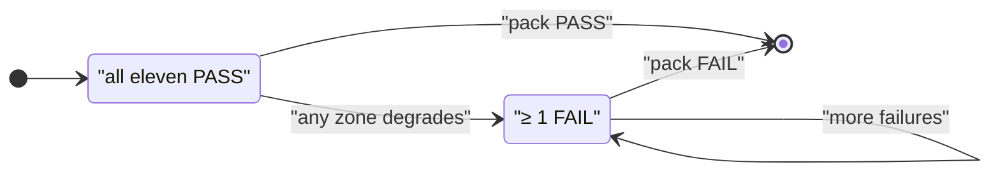
```mermaid
stateDiagram-v2
    direction LR
    AllPass: "all eleven PASS"
    OneFail: "≥ 1 FAIL"
    [*] --> AllPass
    AllPass --> OneFail: "any zone degrades"
    OneFail --> OneFail: "more failures"
    AllPass --> [*]: "pack PASS"
    OneFail --> [*]: "pack FAIL"
```

---

## 4. Zone evaluation functions

Zones are declarative. A repository maps each `ZP-n` to one of five **kinds** in `zp11.toml`. Each kind is a total function into `ZoneResult`, and each is written so that its only route to `PASS` is positive proof.

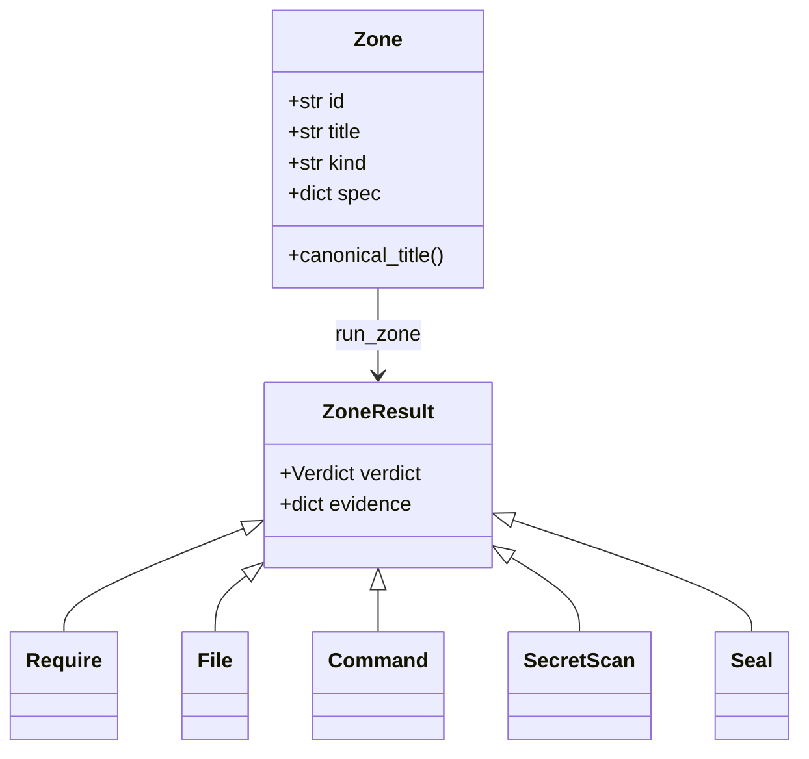
```mermaid
classDiagram
    class Zone {
        +str id
        +str title
        +str kind
        +dict spec
        +canonical_title()
    }
    class ZoneResult {
        +Verdict verdict
        +dict evidence
    }
    Zone --> ZoneResult : run_zone
    ZoneResult <|-- Require
    ZoneResult <|-- File
    ZoneResult <|-- Command
    ZoneResult <|-- SecretScan
    ZoneResult <|-- Seal
```

### 4.1 `require`

Passes iff every named context field is present and non-empty.

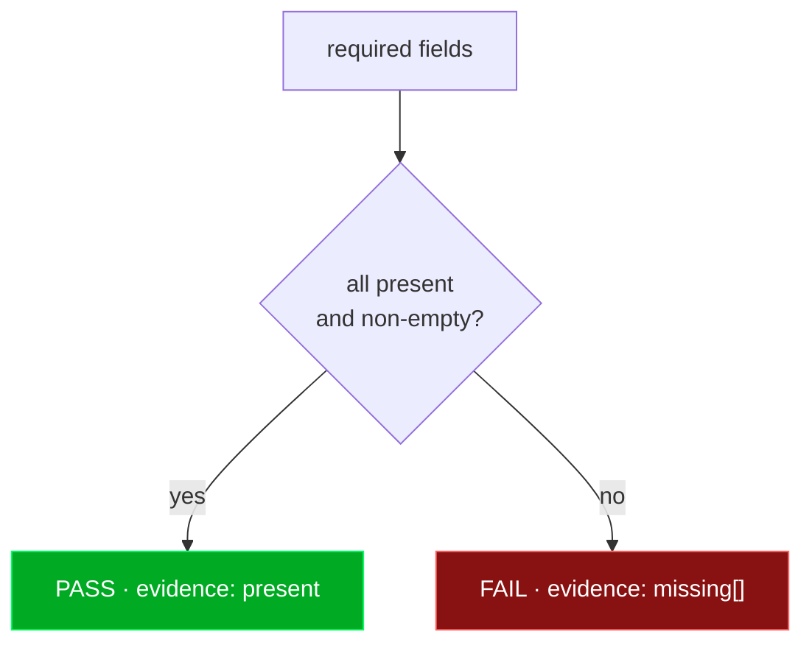
```mermaid
flowchart TD
    S["required fields"] --> L{"all present<br/>and non-empty?"}
    L -->|yes| P["PASS · evidence: present"]
    L -->|no| F["FAIL · evidence: missing[]"]
    classDef ok fill:#0a2,stroke:#0f6,color:#fff;
    classDef no fill:#811,stroke:#f66,color:#fff;
    class P ok; class F no;
```

### 4.2 `file`

Passes iff a path exists and holds at least `min_bytes`; the file's SHA-256 becomes evidence.

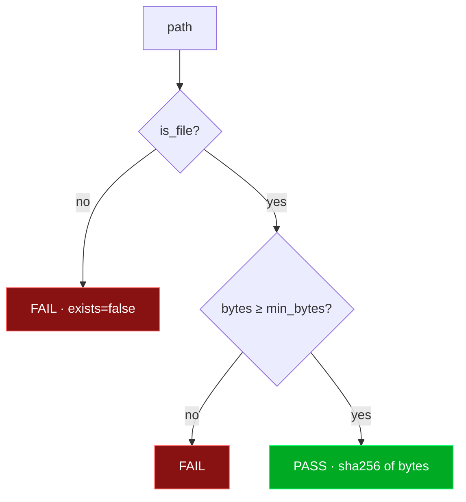
```mermaid
flowchart TD
    A["path"] --> B{"is_file?"}
    B -->|no| F1["FAIL · exists=false"]
    B -->|yes| C{"bytes ≥ min_bytes?"}
    C -->|no| F2["FAIL"]
    C -->|yes| P["PASS · sha256 of bytes"]
    classDef no fill:#811,stroke:#f66,color:#fff;
    classDef ok fill:#0a2,stroke:#0f6,color:#fff;
    class F1,F2 no; class P ok;
```

### 4.3 `command`

Runs a shell command; passes iff the exit code equals `expect_code` (default 0). A digest of `stdout \x00 stderr` is recorded. Timeout or spawn failure is caught and mapped to `FAIL`.

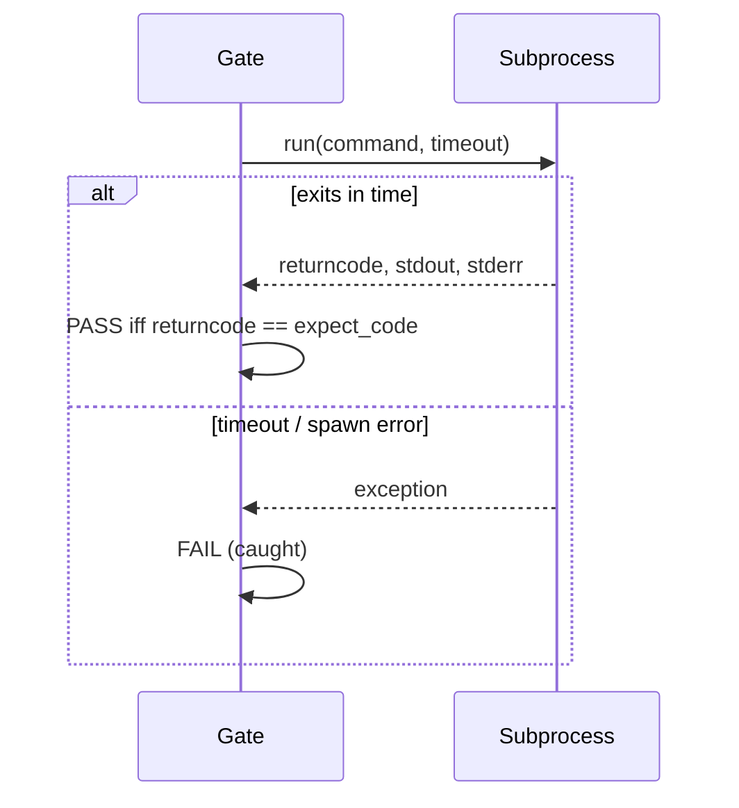
```mermaid
sequenceDiagram
    participant G as Gate
    participant OS as Subprocess
    G->>OS: run(command, timeout)
    alt exits in time
        OS-->>G: returncode, stdout, stderr
        G->>G: PASS iff returncode == expect_code
    else timeout / spawn error
        OS-->>G: exception
        G->>G: FAIL (caught)
    end
```

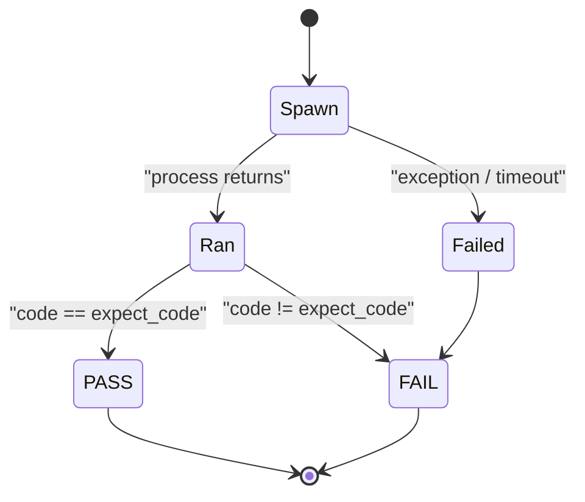
```mermaid
stateDiagram-v2
    [*] --> Spawn
    Spawn --> Ran: "process returns"
    Spawn --> Failed: "exception / timeout"
    Ran --> PASS: "code == expect_code"
    Ran --> FAIL: "code != expect_code"
    Failed --> FAIL
    PASS --> [*]
    FAIL --> [*]
```

### 4.4 `secret_scan`

Scans the declared globs with conservative pattern and entropy detectors and passes iff there are **no** findings. Evidence records only *locations*, never the secret bytes.

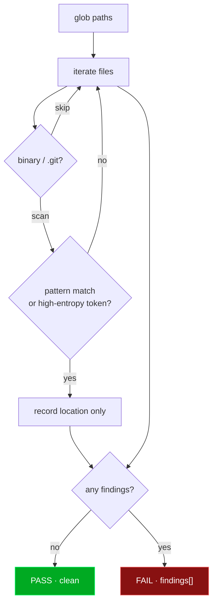
```mermaid
flowchart TD
    G["glob paths"] --> I["iterate files"]
    I --> SK{"binary / .git?"}
    SK -->|skip| I
    SK -->|scan| PR{"pattern match<br/>or high-entropy token?"}
    PR -->|yes| ADD["record location only"]
    PR -->|no| I
    ADD --> V{"any findings?"}
    I --> V
    V -->|no| P["PASS · clean"]
    V -->|yes| F["FAIL · findings[]"]
    classDef ok fill:#0a2,stroke:#0f6,color:#fff;
    classDef no fill:#811,stroke:#f66,color:#fff;
    class P ok; class F no;
```

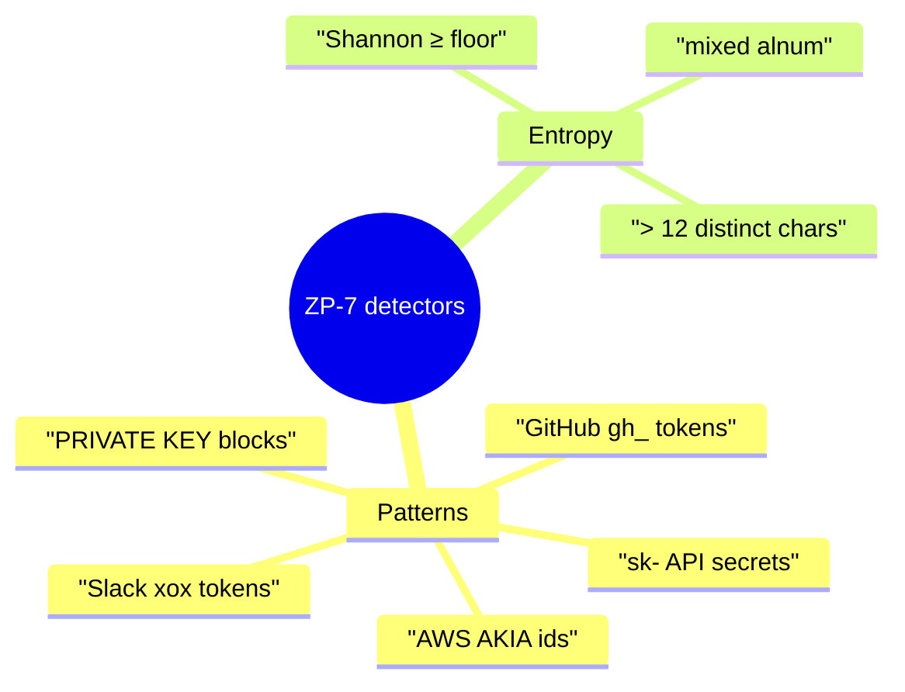
```mermaid
mindmap
  root(("ZP-7 detectors"))
    Patterns
      "PRIVATE KEY blocks"
      "AWS AKIA ids"
      "GitHub gh_ tokens"
      "Slack xox tokens"
      "sk- API secrets"
    Entropy
      "Shannon ≥ floor"
      "mixed alnum"
      "> 12 distinct chars"
```

### 4.5 `seal`

The `seal` kind is never evaluated by `run_zone` directly; it is derived by the gate (Section 6). Called in isolation it returns `FAIL`, so a seal can never be forged by a zone runner.

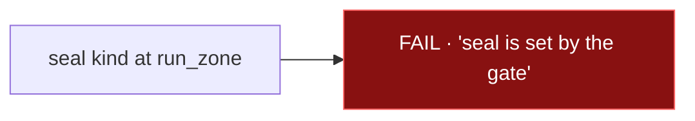
```mermaid
flowchart LR
    SK["seal kind at run_zone"] --> F["FAIL · 'seal is set by the gate'"]
    classDef no fill:#811,stroke:#f66,color:#fff;
    class F no;
```

**Proposition 4.1 (closed by construction).** For every kind, the branch leading to `PASS` is reachable only after an affirmative check; every exception, unknown kind, and empty specification falls through to `FAIL`.

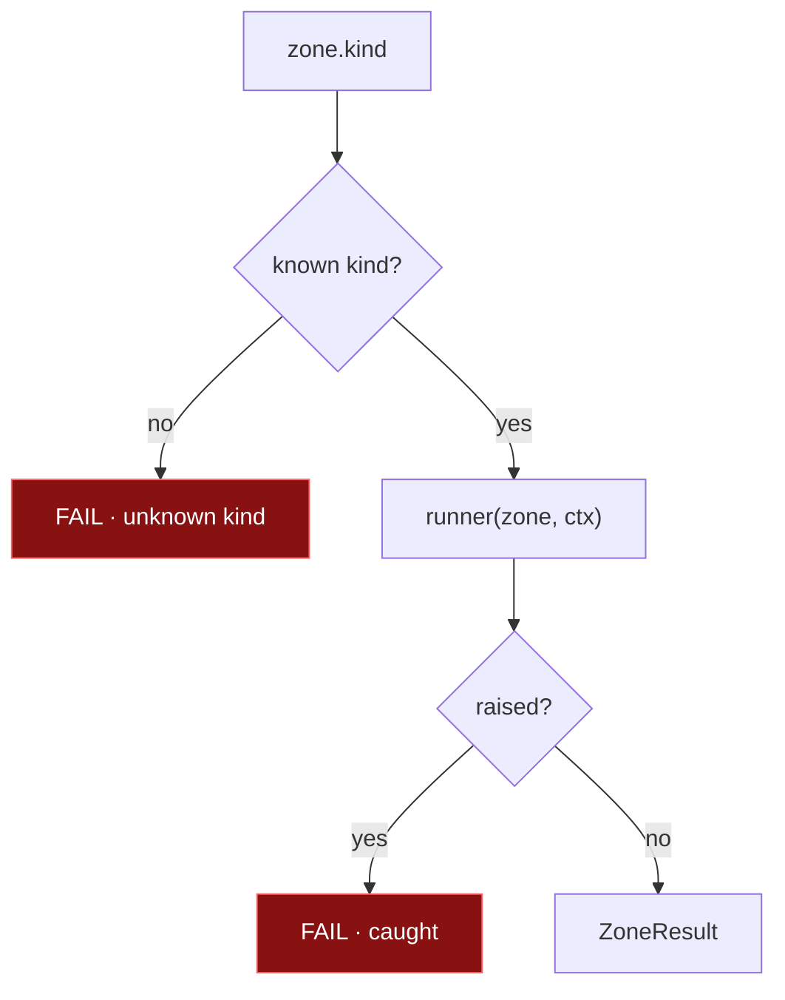
```mermaid
flowchart TD
    K["zone.kind"] --> M{"known kind?"}
    M -->|no| F1["FAIL · unknown kind"]
    M -->|yes| R["runner(zone, ctx)"]
    R --> E{"raised?"}
    E -->|yes| F2["FAIL · caught"]
    E -->|no| OUT["ZoneResult"]
    classDef no fill:#811,stroke:#f66,color:#fff;
    class F1,F2 no;
```

---

## 5. Canonical serialisation semantics

Two honest parties must serialise the same JSON value to the same bytes, or no digest is portable. `c` implements the RFC 8785 (JCS) subset the standard relies on.

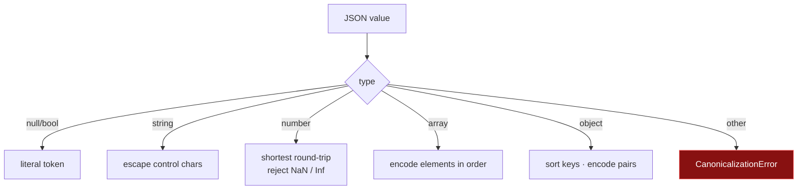
```mermaid
flowchart TD
    V["JSON value"] --> T{"type"}
    T -->|null/bool| LIT["literal token"]
    T -->|string| STR["escape control chars"]
    T -->|number| NUM["shortest round-trip<br/>reject NaN / Inf"]
    T -->|array| ARR["encode elements in order"]
    T -->|object| OBJ["sort keys · encode pairs"]
    T -->|other| ERR["CanonicalizationError"]
    classDef no fill:#811,stroke:#f66,color:#fff;
    class ERR no;
```

Key rules, each load-bearing for determinism:

| Rule | Consequence |
|------|-------------|
| Object keys sorted lexicographically | map order cannot change the bytes |
| Keys must be strings | non-string keys are rejected, not coerced |
| Minimal separators, no whitespace | no insignificant bytes to disagree on |
| NaN / Infinity rejected | no value lacking a canonical form passes |
| Integers printed exactly; floats shortest round-trip | stable across platforms and Python versions |

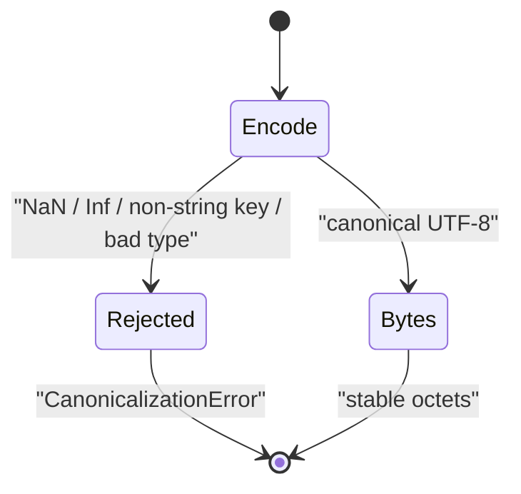
```mermaid
stateDiagram-v2
    [*] --> Encode
    Encode --> Rejected: "NaN / Inf / non-string key / bad type"
    Encode --> Bytes: "canonical UTF-8"
    Rejected --> [*]: "CanonicalizationError"
    Bytes --> [*]: "stable octets"
```

```mermaid
flowchart LR
    O1["{b:1, a:2}"] --> C1["sort keys"]
    O2["{a:2, b:1}"] --> C1
    C1 --> B["identical bytes"]
```

**Lemma 5.1 (functional determinism).** `c` is a function: equal values (up to JSON equality) map to equal byte strings, independent of insertion order, platform, or Python version. Hence `H ∘ c` is a well-defined content address.

```mermaid
flowchart LR
    A["value x"] --> CA["c(x)"]
    B["value x'(x ≡ x')"] --> CB["c(x')"]
    CA --> EQ(("="))
    CB --> EQ
    EQ --> H["same H(c(x))"]
```

---

## 6. Digests, receipts, and the seal

### 6.1 Receipt digest

For a receipt, `body = {id, title, verdict, evidence}` and `digest = "sha256:" + hex(H(c(body)))`. Altering any evidence byte changes the digest.

```mermaid
flowchart LR
    BD["body {id,title,verdict,evidence}"] --> C["c(body)"]
    C --> H["H"]
    H --> DG["sha256:…"]
```

### 6.2 Receipt signature

Each receipt is signed over `c({…body, digest})`, i.e. the body *with its own digest included*, binding the content address into the signed message.

```mermaid
sequenceDiagram
    participant R as Receipt
    participant K as Signer sk
    R->>R: digest = H(c(body))
    R->>K: sign c({...body, digest})
    K-->>R: signature ed25519:…
```

### 6.3 The seal content

The ZP-11 seal is signed over the *ordered chain of receipt digests* bound to the change:

```mermaid
flowchart TB
    SC["seal_content"] --> F1["standard"]
    SC --> F2["created"]
    SC --> F3["change"]
    SC --> F4["verdict"]
    SC --> F5["zones_passed / zones_total"]
    SC --> F6["receipts: [{id, digest} in order]"]
```

Because the seal signs the ordered list `[{id, digest}]`, receipts cannot be reordered, added, or removed without invalidating the seal.

```mermaid
flowchart LR
    D1["ZP-1 digest"] --> CH["ordered chain"]
    D2["ZP-2 digest"] --> CH
    DOT["…"] --> CH
    D11["ZP-11 digest"] --> CH
    CH --> SIG["seal signature"]
```

```mermaid
stateDiagram-v2
    [*] --> Chain
    Chain --> Tampered: "reorder / add / drop a receipt"
    Chain --> Intact: "unchanged"
    Tampered --> SealInvalid: "seal signature fails"
    Intact --> SealValid
    SealInvalid --> [*]
    SealValid --> [*]
```

### 6.4 Gate derivation of ZP-11

The gate derives the seal verdict from `prior_all_pass`, the running conjunction over ZP-1…ZP-10, then signs and sets `sealed = (pack verdict is PASS)`.

```mermaid
sequenceDiagram
    participant G as Gate
    participant P as Pack
    loop ZP-1 … ZP-10
        G->>G: prior_all_pass &= bool(verdict)
    end
    G->>P: ZP-11 verdict = PASS iff prior_all_pass
    G->>P: finalise each receipt digest + signature
    G->>P: seal_signature = S_sk(seal_content)
    G->>P: sealed = (pack verdict == PASS)
```

```mermaid
flowchart TD
    PA["prior_all_pass"] -->|true| S1["ZP-11 PASS · sealed"]
    PA -->|false| S0["ZP-11 FAIL · not sealed · pack still emitted as evidence"]
    classDef ok fill:#0a2,stroke:#0f6,color:#fff;
    classDef no fill:#811,stroke:#f66,color:#fff;
    class S1 ok; class S0 no;
```

A failing run still emits a pack — as evidence of *why* the gate stays shut — but never a sealed one.

---

## 7. The verification algorithm

Given a pack `P` and a public key `K` (or the key embedded in `P` if none is supplied), the verifier `verify_pack` is a total function returning a structured `VerifyReport = (ok, merge_permitted, reasons, zones_passed, zones_total)`.

```mermaid
flowchart TD
    START["verify_pack(P, K)"] --> K0{"key available?"}
    K0 -->|no| RK["reason: no key · merge refused"]
    K0 -->|yes| Z{"strict: all 11 zones present?"}
    Z -->|no| RM["reason: missing zones"]
    Z -->|yes| DGST["per-receipt: recompute digest"]
    DGST --> DM{"digest == stored?"}
    DM -->|no| RD["reason: digest mismatch"]
    DM -->|yes| SIGv{"receipt signature valid?"}
    SIGv -->|no| RS["reason: bad signature"]
    SIGv -->|yes| SEAL{"seal signature valid?"}
    SEAL -->|no| RSE["reason: seal invalid"]
    SEAL -->|yes| AP{"passed == total > 0?"}
    AP -->|no| RF["reason: fail-closed"]
    AP -->|yes| SLD{"sealed == true?"}
    SLD -->|no| RU["reason: not sealed"]
    SLD -->|yes| OK["merge permitted"]
    classDef ok fill:#0a2,stroke:#0f6,color:#fff;
    classDef no fill:#811,stroke:#f66,color:#fff;
    class OK ok; class RK,RM,RD,RS,RSE,RF,RU no;
```

The four normative checks of `SPEC.md §5`:

```mermaid
flowchart LR
    S1["1 · all zones present (strict)"] --> S2["2 · digests recomputed + receipt sigs"]
    S2 --> S3["3 · reconstruct seal_content + verify seal"]
    S3 --> S4["4 · every verdict PASS and sealed=true"]
    S4 --> M["merge iff 1-4 succeed"]
```

```mermaid
stateDiagram-v2
    [*] --> Present
    Present --> Integrity: "zones present"
    Integrity --> Sealed: "digests + sigs OK"
    Sealed --> Decided: "seal OK"
    Decided --> Merge: "all PASS + sealed"
    Present --> Refuse: "missing"
    Integrity --> Refuse: "tamper"
    Sealed --> Refuse: "bad seal"
    Decided --> Refuse: "not all PASS / unsealed"
    Merge --> [*]
    Refuse --> [*]
```

Two derived flags separate *integrity* from *decision*: `ok = (no reasons accrued)` and `merge_permitted = ok ∧ all_pass ∧ sealed`. A missing key always appends a reason, so a keyless verification can never report `ok`.

```mermaid
flowchart LR
    R["reasons = []?"] -->|empty| OKf["ok = true"]
    R -->|non-empty| NOK["ok = false"]
    OKf --> AND(("⋀"))
    AP["all_pass"] --> AND
    SL["sealed"] --> AND
    AND --> MP["merge_permitted"]
```

```mermaid
journey
    title "A verifier's path to a decision"
    section Load
      "Parse pack": 4: Verifier
      "Resolve key": 3: Verifier
    section Check
      "Recompute digests": 4: Verifier
      "Verify receipt sigs": 4: Verifier
      "Verify seal": 4: Verifier
    section Decide
      "All PASS + sealed": 5: Verifier
      "Refuse on any doubt": 2: Verifier
```

---

## 8. The gate decision function

The complete decision is the composition `decide = merge_permitted ∘ verify_pack`. A merge is permitted **iff** every one of the following holds simultaneously.

| Condition | Source | On failure |
|-----------|--------|------------|
| All eleven zones present | strict mode | refuse |
| Every recomputed digest matches | §6.1 | refuse |
| Every receipt signature valid under `K` | §6.2 | refuse |
| Seal signature valid over reconstructed content | §6.3 | refuse |
| `zones_passed == zones_total > 0` | §3 | refuse |
| `sealed == true` | §6.4 | refuse |

```mermaid
flowchart TD
    subgraph Gate["Zero-Point gate decision"]
      A["zones present"] --> B["digests intact"]
      B --> C["receipt signatures"]
      C --> D["seal signature"]
      D --> E["all PASS"]
      E --> F["sealed"]
    end
    F -->|all true| Y["merge permitted"]
    A -->|any false| N["merge refused"]
    classDef ok fill:#0a2,stroke:#0f6,color:#fff;
    classDef no fill:#811,stroke:#f66,color:#fff;
    class Y ok; class N no;
```

```mermaid
sequenceDiagram
    participant Dev as Change
    participant Gate as "ZP-11 gate"
    participant Pack as "Proof-Pack"
    participant V as "Independent verifier"
    Dev->>Gate: propose change → main
    Gate->>Gate: run ZP-1 … ZP-10
    Gate->>Pack: sign receipts (Ed25519)
    Gate->>Pack: ZP-11 seal over the chain
    Pack-->>V: proof-pack.json + public key
    V->>V: recompute digests, verify, re-run ZP-10
    V-->>Dev: merge ⟺ sealed PASS
```

---

## 9. Soundness

Let an **honest sealed pack for `K`** be a pack produced by running the gate with key pair `(sk, pk)` where `pk = K`, over zones that all returned `PASS`. Soundness says the verifier accepts only such packs (up to the unforgeability of Ed25519 and the collision resistance of SHA-256).

```mermaid
flowchart TD
    ACC["verifier accepts P"] --> C1["seal signature valid under K"]
    C1 --> C2["∴ seal_content signed by holder of sk"]
    C2 --> C3["seal_content binds ordered receipt digests"]
    C3 --> C4["each digest = H(c(body)); sigs valid"]
    C4 --> C5["∴ each receipt is the one the signer sealed"]
    C5 --> C6["all verdicts PASS + sealed"]
    C6 --> CONC["∴ honest sealed PASS run for K"]
    classDef ok fill:#0a2,stroke:#0f6,color:#fff;
    class CONC ok;
```

**Theorem 9.1 (soundness).** If `verify_pack(P, K).merge_permitted` is true, then — except with probability negligible in the security parameters of Ed25519 and SHA-256 — `P` is an honest sealed PASS pack bound to `K`.

*Argument.* Acceptance requires a valid seal signature over the reconstructed `seal_content`. By EUF-CMA security of Ed25519, only the holder of `sk` with `pk = K` could have produced it, so the signer committed to exactly the ordered list of `(id, digest)` pairs and the `change`. Each accepted receipt's stored digest equals `H(c(body))`; by collision resistance, the signer's committed digest fixes the receipt body. Swapping any evidence changes `c(body)`, hence the digest, hence breaks the seal. Finally acceptance requires `all_pass ∧ sealed`, which the gate sets only when every prior zone passed. ∎

```mermaid
stateDiagram-v2
    [*] --> Accepted
    Accepted --> SealBound: "seal sig ⇒ signer committed chain"
    SealBound --> DigestBound: "digest ⇒ body fixed"
    DigestBound --> VerdictBound: "all PASS ⇒ honest run"
    VerdictBound --> [*]: "sound"
```

```mermaid
flowchart LR
    F["forge attempt"] --> FA{"alter evidence"}
    FA --> D1["digest changes"]
    D1 --> D2["receipt sig / seal fails"]
    F --> FB{"reorder receipts"}
    FB --> D3["seal_content changes"]
    D3 --> D2
    F --> FC{"swap key"}
    FC --> D4["sig invalid under K"]
    D4 --> D2
    D2 --> R["refused"]
    classDef no fill:#811,stroke:#f66,color:#fff;
    class R no;
```

### 9.1 Binding the change

The `change` is inside `seal_content`, so a sealed pack is bound to a specific `source_commit` and `builder`; it cannot be transplanted onto a different change.

```mermaid
flowchart LR
    CHG["change {id, source_commit, builder}"] --> SC["seal_content"]
    SC --> SIG["seal signature"]
    SIG --> BIND["pack bound to this change"]
```

### 9.2 No cross-gate assembly

Because the seal signs the digests *together*, receipts that never shared one gate run cannot be stitched into a pack that verifies.

```mermaid
flowchart TD
    GA["gate run A: receipts rA"] --> SA["seal A"]
    GB["gate run B: receipts rB"] --> SB["seal B"]
    MIX["mix rA with rB"] --> BAD["no seal over mixed chain"]
    BAD --> REF["refused"]
    classDef no fill:#811,stroke:#f66,color:#fff;
    class REF no;
```

---

## 10. Fail-closed completeness

Soundness says "no false accept"; the complementary property says every ambiguity becomes a refusal.

```mermaid
mindmap
  root(("Routes to FAIL"))
    "Zone level"
      "exception caught"
      "timeout"
      "unknown kind"
      "empty spec"
    "Verdict level"
      "non-PASS coerced"
      "empty pack = FAIL"
    "Pack level"
      "missing zone"
      "digest mismatch"
      "bad signature"
    "Verifier level"
      "no key"
      "unsealed"
```

**Theorem 10.1 (fail-closed).** For every input the verifier terminates and returns a verdict; and for every way a gate run can be incomplete, ambiguous, or corrupted, the verifier returns `merge_permitted = false`.

```mermaid
flowchart TD
    IN["any input P, K"] --> T["verify_pack total"]
    T --> ANY{"any defect?"}
    ANY -->|yes| REF["merge refused"]
    ANY -->|no| OK["merge permitted"]
    classDef no fill:#811,stroke:#f66,color:#fff;
    classDef ok fill:#0a2,stroke:#0f6,color:#fff;
    class REF no; class OK ok;
```

*Argument.* Totality: every zone runner catches exceptions and every verifier step appends a reason rather than raising. Ambiguity: the verdict algebra coerces anything non-`PASS` to `FAIL` (Def 3.1), the empty conjunction is `FAIL` (§3), and a missing key appends a reason (§7). Corruption: any altered byte breaks a digest or signature. In every branch at least one reason accrues, so `ok` is false and `merge_permitted` is false. ∎

```mermaid
stateDiagram-v2
    [*] --> Silence
    Silence --> FAIL: "no verdict ⇒ FAIL"
    [*] --> Crash
    Crash --> FAIL: "caught ⇒ FAIL"
    [*] --> Timeout
    Timeout --> FAIL: "caught ⇒ FAIL"
    [*] --> Missing
    Missing --> FAIL: "file absent ⇒ FAIL"
    FAIL --> [*]
```

```mermaid
flowchart LR
    NK["key unavailable"] --> RF["reason appended"]
    RF --> DEF["verifier defaults to refusing merge"]
    classDef no fill:#811,stroke:#f66,color:#fff;
    class DEF no;
```

The gate never offers a third verdict that permits merge; the two-element verdict set admits none.

```mermaid
flowchart TD
    V["verdict set"] --> P["PASS"]
    V --> F["FAIL"]
    V -.->|"forbidden"| X["(no third state)"]
    classDef no fill:#811,stroke:#f66,color:#fff;
    class X no;
```

---

## 11. Independent re-run (ZP-10) and determinism

ZP-10 exists to detect a compromised primary runner: a second, isolated runner must reproduce the verdict. Soundness of the *re-run* rests on determinism of `c`, `H`, and the zone functions.

```mermaid
flowchart LR
    R1["runner A"] --> P1["pack A"]
    R2["runner B (isolated)"] --> P2["pack B"]
    P1 --> CMP{"same verdicts<br/>+ digests?"}
    P2 --> CMP
    CMP -->|yes| OK["ZP-10 PASS"]
    CMP -->|no| F["ZP-10 FAIL"]
    classDef ok fill:#0a2,stroke:#0f6,color:#fff;
    classDef no fill:#811,stroke:#f66,color:#fff;
    class OK ok; class F no;
```

```mermaid
sequenceDiagram
    participant A as "Primary runner"
    participant B as "Independent runner"
    participant V as Verifier
    A->>V: proof-pack.json
    B->>B: re-run zones on clean host
    B->>V: recomputed digests
    V->>V: compare verdicts + content addresses
    V-->>A: agree ⟺ ZP-10 PASS
```

Determinism is what makes the comparison meaningful: equal inputs produce equal canonical bytes, equal digests, and — for deterministic checks — equal verdicts. The two runners SHOULD NOT share state, so agreement is evidence against a single point of compromise.

```mermaid
flowchart TD
    DET["c · H deterministic"] --> SAME["same bytes ⇒ same digest"]
    SAME --> CMP["cross-runner comparison is exact"]
    NSH["no shared state"] --> IND["failures are independent"]
    CMP --> TRUST["ZP-10 meaningful"]
    IND --> TRUST
```

```mermaid
stateDiagram-v2
    [*] --> TwoRuns
    TwoRuns --> Agree: "identical verdicts + digests"
    TwoRuns --> Disagree: "any divergence"
    Agree --> Pass10: "ZP-10 PASS"
    Disagree --> Fail10: "ZP-10 FAIL"
    Pass10 --> [*]
    Fail10 --> [*]
```

---

## 12. Key handling and trust root

Signing keys are the root of trust and MUST live outside the gated repository. The verifier defaults to **refusing** merge when `K` is unavailable, so the absence of a trust anchor is never read as consent.

```mermaid
flowchart LR
    SK["private key sk (external)"] -->|signs| PACK["receipts + seal"]
    PK["public key K"] -->|verifies| PACK
    NOK["K missing"] --> REF["refuse by default"]
    classDef no fill:#811,stroke:#f66,color:#fff;
    class REF no;
```

```mermaid
mindmap
  root(("Key discipline"))
    Storage
      "outside gated repo"
      "rotated per policy"
    Encoding
      "ed25519:hex"
      "32 raw bytes"
    Default
      "no key ⇒ refuse"
    Separation
      "ZP-10 runner distinct"
```

```mermaid
timeline
    title "Key lifecycle around a gate run"
    section Setup
      "keygen" : "Ed25519 pair created outside repo"
    section Run
      "sign receipts" : "each body + digest"
      "seal" : "ordered chain + change"
    section Verify
      "public key only" : "verifier needs nothing else"
    section Rotate
      "policy-driven" : "retire + re-issue"
```

---

## 13. End-to-end lifecycle

The following gantt sketches the ordered phases of one gate evaluation; it encodes sequence, not wall-clock guarantees.

```mermaid
gantt
    title "One ZP-11 gate evaluation (ordering)"
    dateFormat X
    axisFormat %s
    section Collect
      "Run ZP-1 … ZP-10" : 0, 6
    section Seal
      "Derive ZP-11" : 6, 7
      "Digest + sign receipts" : 7, 8
      "Sign seal" : 8, 9
    section Verify
      "Recompute + verify" : 9, 11
      "Decide merge" : 11, 12
```

```mermaid
flowchart LR
    C["collect verdicts"] --> S["seal chain"]
    S --> E["emit pack"]
    E --> V["verify"]
    V --> D{"merge?"}
    D -->|yes| M["open gate"]
    D -->|no| X["stay shut"]
    classDef ok fill:#0a2,stroke:#0f6,color:#fff;
    classDef no fill:#811,stroke:#f66,color:#fff;
    class M ok; class X no;
```

```mermaid
journey
    title "Change through the gate"
    section Propose
      "Open change to main": 3: Dev
    section Evaluate
      "Zones run": 4: Gate
      "Seal": 4: Gate
    section Verify
      "Re-run + verify": 4: Verifier
    section Outcome
      "Merge on sealed PASS": 5: Dev
      "Blocked otherwise": 1: Dev
```

---

## 14. Conformance obligations

An implementation is **conformant** iff it satisfies four obligations, each a direct corollary of the model above. The reference library is the normative oracle for test vectors.

```mermaid
flowchart TD
    A["(a) packs validate against schema"] --> OK["conformant"]
    B["(b) any non-PASS condition ⇒ FAIL"] --> OK
    C["(c) digests + signatures as in §6"] --> OK
    D["(d) refuse merge unless §7 succeeds"] --> OK
    classDef ok fill:#0a2,stroke:#0f6,color:#fff;
    class OK ok;
```

```mermaid
erDiagram
    IMPLEMENTATION ||--|{ OBLIGATION : "must satisfy"
    OBLIGATION ||--o{ TEST_VECTOR : "checked by"
    REFERENCE ||--|{ TEST_VECTOR : "is oracle for"
    OBLIGATION {
        string label
        string clause
    }
```

```mermaid
stateDiagram-v2
    [*] --> Candidate
    Candidate --> Conformant: "(a)(b)(c)(d) all hold"
    Candidate --> NonConformant: "any obligation fails"
    Conformant --> [*]
    NonConformant --> [*]
```

A conforming configuration MAY map a zone to any check meeting its normative requirement, and MUST map an unimplemented zone to a check returning `FAIL` — never omit it, which strict verification would catch as a missing zone anyway.

```mermaid
flowchart LR
    UNIMPL["unimplemented zone"] --> MAP["map to FAIL-returning check"]
    MAP --> SAFE["gate stays shut, not silent"]
    classDef no fill:#811,stroke:#f66,color:#fff;
    class SAFE no;
```

---

## 15. Summary of guarantees

```mermaid
mindmap
  root(("ZP-11 guarantees"))
    Soundness
      "accept ⇒ honest sealed PASS"
      "bound to key + change"
    "Fail-closed"
      "total function"
      "ambiguity ⇒ refuse"
    Integrity
      "digest over canonical form"
      "Ed25519 receipt + seal"
    Portability
      "pack + public key suffice"
    Reproducibility
      "deterministic c · H"
      "ZP-10 cross-runner"
```

```mermaid
flowchart LR
    E["evidence"] --> G{"gate"}
    G -->|"complete + signed + sealed"| OPEN["merge permitted"]
    G -->|"anything else"| SHUT["merge refused"]
    classDef ok fill:#0a2,stroke:#0f6,color:#fff;
    classDef no fill:#811,stroke:#f66,color:#fff;
    class OPEN ok; class SHUT no;
```

The model delivers the standard's single idea with mathematical force: **absence of evidence is treated as failure, never as consent.** Soundness guarantees that an open gate reflects a real, signed, sealed, all-PASS run bound to the trusted key; fail-closed completeness guarantees that every gap, crash, or tamper closes it. Both follow from a two-element verdict algebra, a deterministic canonical form, and a seal that signs the ordered chain of receipt digests — the design authored by Naquib Hatami and published as `zp11/v1`.

```mermaid
stateDiagram-v2
    [*] --> Shut
    Shut --> Open: "sealed PASS verified under K"
    Open --> Shut: "any later tamper fails re-verification"
    Open --> [*]: "merge"
    Shut --> [*]: "blocked"
```

---

## Related documents

- `01-whitepaper.md` — the motivating argument and the one idea in prose.
- `02-srs.md` — the normative software requirements behind this model.
- `04-detailed-design.md` — the reference library's module-level design.
- `07-crypto-design.md` — Ed25519 and canonical-digest construction in depth.
- `13-conformance.md` — test vectors and the conformance obligations formalised here.
